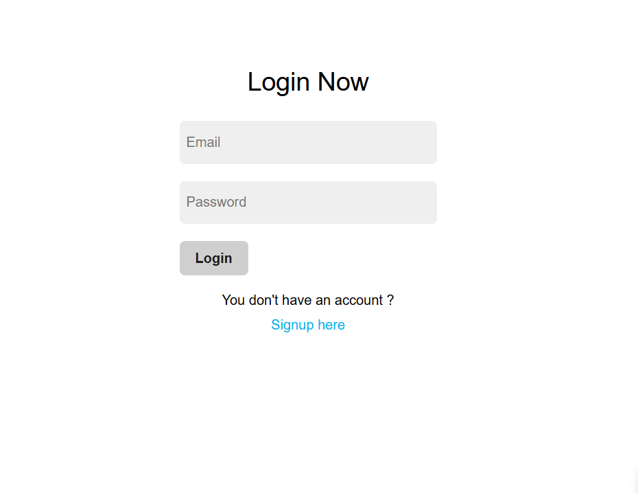

# User Authentication System (Servlet + JSP + MySQL)

This project is a **user authentication system** built using **Java Servlets, JSP, and MySQL**. It includes:
✅ User **Registration**  
✅ User **Login**  
✅ User **Logout**  
✅ Passwords stored securely in the database  

## 🚀 Technologies Used
- **Java Servlets**
- **JSP (JavaServer Pages)**
- **MySQL** (for storing user data)
- **JDBC** (for database connectivity)
- **HTML, CSS**

## 📌 Features
- Register new users and store data in MySQL
- Secure login authentication
- Session-based user login/logout
- Input validation for user registration

